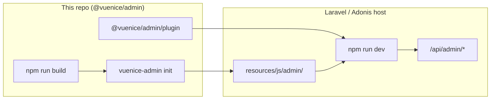
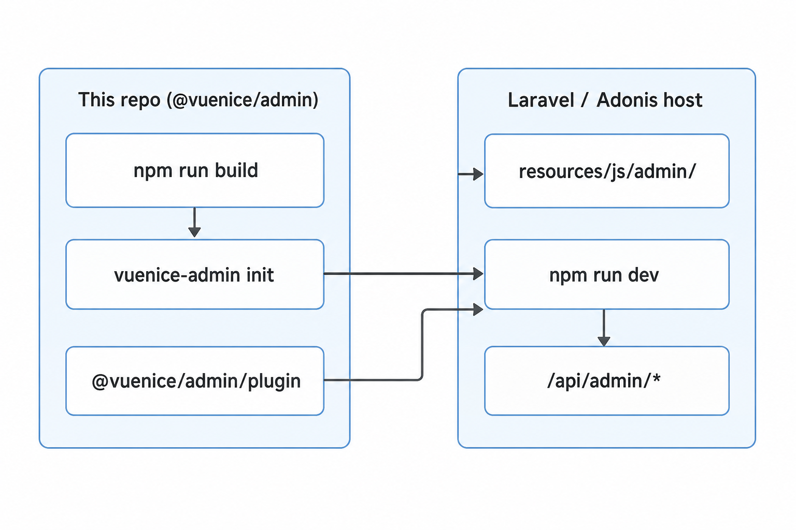

# @vuenice/admin

Framework-agnostic Vue 3 admin SPA scaffold + Vite plugin. Drop it into any backend that already has a `@vite` directive — **Laravel**, **AdonisJS**, or anything else — and you get a working admin shell with:

- Left sidebar for menu navigation
- Right sidebar with an AI chat panel (gated on a server-managed LLM key)
- Top bar with breadcrumbs + user menu
- Sign-in / register / forgot-password pages wired to a documented backend contract
- Vue Router 4, Pinia, axios with session-cookie + CSRF support
- All UI built from the [vuenice](https://github.com/vuenice) component packages, with safe fallback components shipped in the scaffold so the SPA boots before any optional GitHub install resolves

The package itself ships **no PHP and no Edge** — instead it gives you a small Vite plugin, a `vuenice-admin init` CLI that copies the SPA scaffold into your project, and a short backend contract you implement once per framework.

> **Note:** This repository is an **npm library** (CLI + Vite plugin + scaffold templates), not a standalone Vue app. There is no `npm run dev` here that opens a browser by itself.

## Developing this package

If you cloned this repo to work on `@vuenice/admin` itself:

```bash
npm install
npm run build      # compile CLI, plugin, and types into dist/
npm run dev        # same as build, but watch mode while editing src/
npm run typecheck  # tsc --noEmit
npm run lint       # eslint on .ts files
```

| Script       | Purpose                                      |
|--------------|----------------------------------------------|
| `build`      | Build CLI, plugin, and types into `dist/`    |
| `dev`        | Watch rebuild while editing `src/`           |
| `typecheck`  | TypeScript check without emitting            |
| `lint`       | ESLint                                       |

There is **no** `test` script yet (no Vitest/Jest suite in this package).

To try the CLI locally after a build:

```bash
npm run build
npx vuenice-admin init
```

Or link into another project: run `npm link` in this repo, then `npm link @vuenice/admin` in the host app.

### Troubleshooting `npm install`

If you see `npm error Invalid Version:` on Windows, the `package-lock.json` may be corrupted (often from installing on Linux/WSL first). Fix it with a clean install:

```bash
rm -rf node_modules package-lock.json   # PowerShell: Remove-Item -Recurse node_modules; Remove-Item package-lock.json
npm install
```

Regenerate the lockfile on the same OS you develop on, or delete it when switching between Windows and WSL.

## How it fits together





## Running and testing the admin UI

The UI lives in the **scaffold** copied into a **host** app (Laravel, AdonisJS, etc.), not in this repo’s root.

1. In the host project: `npm install -D @vuenice/admin`
2. Scaffold: `npx vuenice-admin init` → creates something like `resources/js/admin/`
3. Install SPA deps: `cd resources/js/admin` then `npm install`
4. In the host `vite.config.ts`, add `@vuenice/admin/plugin` (see [Wire the Vite plugin](#wire-the-vite-plugin) below)
5. Add a Blade/Edge view with `#vuenice-admin` and `@vite(['resources/js/admin/main.ts'])`
6. Implement the API routes in [docs/BACKEND_CONTRACT.md](./docs/BACKEND_CONTRACT.md)
7. From the **host** project: `npm run dev` (plus your backend, e.g. `php artisan serve`)

Framework notes: [docs/LARAVEL.md](./docs/LARAVEL.md), [docs/ADONIS.md](./docs/ADONIS.md).

The scaffold’s `package.json` (from `scaffold/package.json.tpl`) only defines `typecheck` — Vite dev is driven by the **host** app’s Vite setup.

## Install

```bash
npm install -D @vuenice/admin
```

## Scaffold the SPA

From your host project root:

```bash
npx vuenice-admin init
```

This creates `resources/js/admin/` (override with `--dir`). The directory is **yours** — every file is a normal Vue file you can edit, rename, or delete.

Then install the SPA's own dependencies (Vue, Vue Router, Pinia, vue-nice-*):

```bash
cd resources/js/admin
npm install
```

> Most VueNice repos are GitHub-only. If a particular GitHub install fails because the upstream repo doesn't ship a built `dist/`, comment it out in `package.json` — the scaffold's `components/fallbacks/` directory already covers the layout-critical pieces (button, input, sidebar menu, header, alert).

## Wire the Vite plugin

In your **host** `vite.config.{ts,js}`:

```ts
import { defineConfig } from 'vite';
import vue from '@vitejs/plugin-vue';
import laravel from 'laravel-vite-plugin';      // or: import adonis from '@adonisjs/vite/client';
import vuenice from '@vuenice/admin/plugin';

export default defineConfig({
  plugins: [
    laravel({ input: ['resources/js/admin/main.ts'], refresh: true }),
    vue(),
    vuenice({
      root: 'resources/js/admin',
      apiProxy: 'http://localhost:8000', // your backend dev server
    }),
  ],
});
```

The plugin:

- proxies `/api/admin/*` (and `/sanctum/*`) to your backend during `npm run dev`
- aliases `@admin/*` to the scaffold root so app code can `import` from there
- aliases `@vuenice/*` → `vue-nice-*` so imports stay stable regardless of the underlying package name
- injects `__VUENICE_ADMIN_MOUNT__` so the SPA finds its mount element

## Mount it from one backend route

The SPA is a single-page app — point one route at one template.

**Laravel** (`resources/views/admin.blade.php`):

```blade
<!DOCTYPE html>
<html>
<head>
  <meta charset="utf-8">
  <meta name="csrf-token" content="{{ csrf_token() }}">
  <title>Admin</title>
  @vite(['resources/js/admin/main.ts'])
</head>
<body><div id="vuenice-admin" data-base="/admin"></div></body>
</html>
```

```php
// routes/web.php
Route::get('/admin/{any?}', fn () => view('admin'))->where('any', '.*');
```

**AdonisJS v6** (`resources/views/admin.edge`):

```edge
<!DOCTYPE html>
<html>
<head>
  <meta charset="utf-8">
  <meta name="csrf-token" content="{{ csrfToken }}">
  <title>Admin</title>
  @vite(['resources/js/admin/main.ts'])
</head>
<body><div id="vuenice-admin" data-base="/admin"></div></body>
</html>
```

```ts
// start/routes.ts
import router from '@adonisjs/core/services/router';
router.get('/admin/*', ({ view }) => view.render('admin'));
```

## Implement the backend contract

The SPA expects these endpoints. The shapes are documented in [docs/BACKEND_CONTRACT.md](./docs/BACKEND_CONTRACT.md):

| Method | Path                              | Purpose                              |
|-------:|-----------------------------------|--------------------------------------|
| GET    | `/api/admin/auth/me`              | Current user (or 401)                |
| POST   | `/api/admin/auth/login`           | Sign in                              |
| POST   | `/api/admin/auth/register`        | Create account                       |
| POST   | `/api/admin/auth/logout`          | Sign out                             |
| POST   | `/api/admin/auth/forgot-password` | Email reset link                     |
| GET    | `/api/admin/menu`                 | (Optional) backend-driven menu       |
| GET    | `/api/admin/llm/status`           | Whether an LLM key is configured     |
| POST   | `/api/admin/llm/chat`             | Chat completion (JSON or SSE stream) |

See [docs/LARAVEL.md](./docs/LARAVEL.md) and [docs/ADONIS.md](./docs/ADONIS.md) for short implementation notes.

## Scaffold layout

```
resources/js/admin/
├── main.ts                  # SPA entry — mounts to #vuenice-admin
├── App.vue                  # layout switcher (admin vs auth)
├── router/
│   ├── index.ts             # Vue Router 4 + guards
│   └── routes.ts            # edit me to add pages
├── layouts/
│   ├── AdminLayout.vue      # left | content | right shell
│   └── AuthLayout.vue       # centered card
├── components/
│   ├── LeftSidebar.vue
│   ├── RightSidebar.vue
│   ├── TopBar.vue
│   ├── AiChatPanel.vue
│   └── fallbacks/           # swap to real vue-nice-* imports here
├── pages/
│   ├── Dashboard.vue
│   ├── NotFound.vue
│   └── auth/{Login,Register,ForgotPassword}.vue
├── stores/                  # Pinia: auth, menu, chat
├── api/                     # axios client + endpoint wrappers
├── config/menu.ts           # edit me to add menu items
└── styles/                  # design tokens + base CSS
```

## Why a scaffold instead of a black-box package?

Admin panels accrete custom code fast. By copying the SPA into your project instead of importing it as a sealed component, every Vue file is **yours** the day you start. The package keeps doing exactly two things over time:

1. Ship the Vite plugin (`@vuenice/admin/plugin`)
2. Ship updated scaffold stubs (re-run `vuenice-admin init --force` per-file if you want to pick up changes)

## License

MIT
